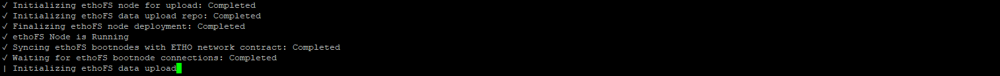

# ethofs-cli
Command-line Interface/Access to The ethoFS Upload System/Network

## Pre-built Binaries

```shell
build/bin/ethofs-cli-windows
build/bin/ethofs-cli-linux
```

## Running pre-built binary (register new ethoFS account)

```shell
./build/bin/ethofs-cli-linux -register -name={AccountName} -key={PrivateKey}
```

## Running pre-built binary (list currently hosted data)

```shell
./build/bin/ethofs-cli-linux -list -key={PrivateKey}
```

## Running pre-built binary (standard upload)

```shell
./build/bin/ethofs-cli-linux -upload -path=test.txt -key={PrivateKey}
```

## Running pre-built binary (recursive directory upload)

```shell
./build/bin/ethofs-cli-linux -r -upload -path=testDir -key={PrivateKey}
```

## Running pre-built binary (remove upload)

```shell
./build/bin/ethofs-cli-linux -remove -contractaddress={HostingContractAddress} -key={PrivateKey}
```

## Running pre-built binary (upload contract extension)

```shell
./build/bin/ethofs-cli-linux -extend -blocks={ExtensionBlockCount} -contractaddress={HostingContractAddress} -key={PrivateKey}
```

## Running pre-built binary - utilizing IPC/RPC system for automated ethoFS calls

### Start an ethoFS IPC session

```shell
./build/bin/ethofs-cli-linux -ipc
```

### Make a remote ethoFS call - retrieving existing hosting contracts (json format)

```shell
echo '{"method":"ethofs_list","params":["{PrivateKey}"],"id":1}' | nc -U ethofs.ipc
```


